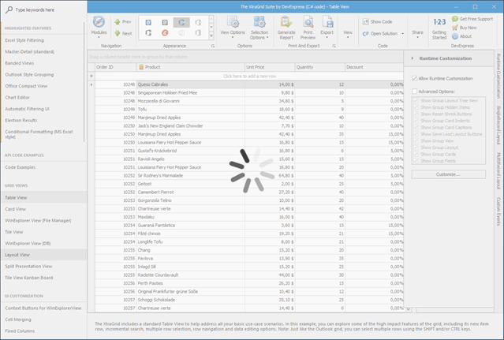
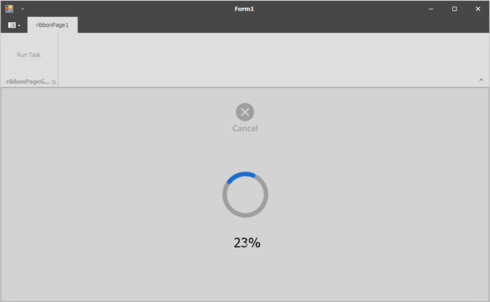

<!-- default badges list -->

<!-- default badges end -->
# WinForms Overlay Form - Custom painter
This example shows how to draw an [Overlay Form](https://documentation.devexpress.com/WindowsForms/120029/Controls-and-Libraries/Forms-and-User-Controls/Splash-Screen-Manager/Overlay-Form).

## Overview
An Overlay Form is a semi-transparent splash screen that runs in a background thread and overlays a control or form to prevent access to it. The Overlay Form contains only a wait indicator by default. 

This example shows how to display:

* a percentage label below the wait indicator;
* a custom button that terminates the processed task and closes the Overlay Form.

You can change the label text, button glyph, and the action performed on a click.

## Implementation details

* Inherit from the `OverlayWindowPainterBase` class. 
* Override the `Draw` method.
* Pass the created object as a parameter to the `SplashScreenManager.ShowOverlayForm` method.

In this example, there are `OverlayImagePainter` and `OverlayTextPainter` objects. Both objects derive from the `OverlayWindowPainterBase` class and implement the drawing logic for the image and text, respectively. You can use their APIs to customize the image and text.

The `OverlayImagePainter` object draws a custom image at the center-top of the Overlay Form and handles clicks on the image. You can specify the following properties:

* `Image` - the image in the normal state;
* `HoverImage` - the image in the hovered state;
* `ClickAction` - an action performed with a click on the image;

The `OverlayTextPainter` object draws a custom label below the wait indicator. You can specify the following properties:

* `Text` - the label text;
* `Font` - the text font (Tahoma, 18 is used by default);
* `Color` - the text color (black by default).

The `OverlayWindowCompositePainter` object composes the drawing logic in the `OverlayImagePainter` and `OverlayTextPainter` objects and is passed to the `SplashScreenManager.ShowOverlayForm` method.

The actual operation performed while the Overlay Form is shown is implemented using the cancellable task available the .NET Framework Class Labrary (Task Parallel Library (TPL)).
